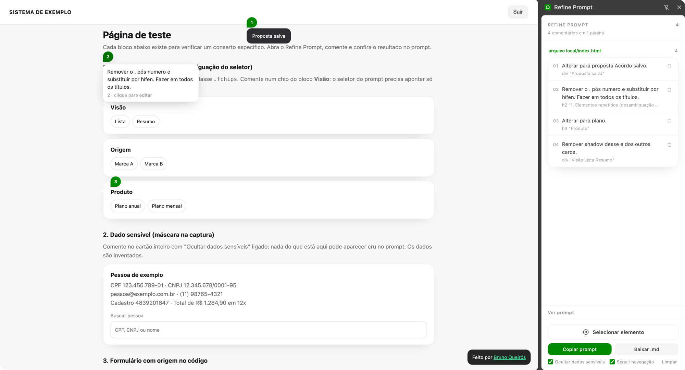

# Refine Prompt

Extensão do Chrome que **comenta elementos de qualquer página** e exporta os
pedidos como **prompt** (para colar num agente de código) ou **.md**. A sessão
atravessa páginas: dá para validar várias telas de um sistema seguido e passar
tudo de uma vez.

O painel é o **side panel nativo** do Chrome - histórico no meio, ações
embaixo, e a página encolhe de verdade em vez de ficar coberta.



---

## Instalar

O Chrome não permite instalar extensão descompactada por script, então este
passo é manual:

1. Abra `chrome://extensions`
2. Ligue **Modo do desenvolvedor** (canto superior direito)
3. **Carregar sem compactação** → selecione esta pasta (`refine-prompt`)
4. Para testar em `file://` (a página de teste em `demo/`), abra os detalhes da
   extensão e habilite **"Permitir acesso a URLs de arquivo"**

Depois de mudar qualquer arquivo: recarregue no card da extensão. Recarregar a
página aberta também vale, porque o content script antigo só morre com o
documento - mas não é mais obrigatório: a injeção nova derruba a anterior e
neutraliza o que sobrar dela (ver as regras de arquitetura).

## Usar

1. Clique no ícone da extensão. O side panel abre e, em sessão vazia, a seleção
   já entra armada.
2. Clique no elemento que precisa mudar. O que está sob o cursor acende, com a
   etiqueta e o tamanho no tooltip.
3. **A caixa de comentário abre encostada no elemento**, na própria página.
   Escreve e `Enter`. Enquanto ela está aberta o realce fica travado no
   elemento escolhido - mover o mouse não muda mais nada. Fechou, a seleção
   volta armada e o próximo clique já é o próximo comentário.
4. Navegue e repita quantas páginas quiser (ver "Seguir navegação").
5. No painel: **Copiar prompt** ou **Baixar .md**. "Ver prompt" abre a gaveta
   com o texto exato, para revisar antes de colar.

O painel não é onde se escreve: ele guarda o histórico, exporta, e é onde se
edita um comentário que já existe (clicando nele). Comentário novo nasce na
página, ao lado do elemento - com o campo do outro lado da tela, o realce
travado no clique não tem explicação visível e parece que a extensão travou.

Atalhos e gestos:

| | |
|---|---|
| `Alt` | cicla os elementos sob o cursor, como o inspecionar do DevTools |
| `Esc` | fecha a caixa de comentário; sem caixa aberta, sai da seleção |
| `Enter` | salva o comentário; `Shift+Enter` quebra linha |
| clicar em outro elemento | com a caixa vazia, reaponta para ele; com texto escrito, não faz nada (não se perde rascunho) |
| passar o mouse num pin | mostra o comentário num balão, na própria página |
| clicar num pin | reabre a caixa sobre o elemento, com o texto que já estava lá |
| clicar num comentário do painel | edita o texto (serve para comentário de outra página) |
| passar o mouse num comentário | acende o elemento na página |

### Seguir navegação

`activeTab` - a permissão que o clique no ícone concede - **é revogada em cada
navegação**. Sem mais nada, seria preciso clicar no ícone em cada página.

O checkbox **Seguir navegação** pede em runtime a permissão de host (`*://*/*`)
e, com ela, a extensão se reinjeta sozinha a cada página carregada na aba à
vista, enquanto o painel estiver aberto. É opcional de propósito: a permissão
não está declarada no manifest, então a extensão só tem o alcance que você
concedeu, e você pode revogar desmarcando.

### Ocultar dados sensíveis

Ligado por padrão. Mascara CPF, CNPJ, e-mail, telefone e sequências longas de
dígitos no HTML capturado, no texto do elemento **e na URL** (query string
carrega id de contrato com frequência). Desligue só em página que é sua -
protótipo local, `localhost`. Valor em real, data e id curto passam intactos.

Trocar a opção no meio da sessão é seguro: o agrupamento por página não usa a
URL exibida (ver a regra 9 da arquitetura), então ligar ou desligar não parte a
sessão em duas. O que já foi capturado não muda - a máscara vale da próxima
captura em diante.

## O que sai no prompt

Cabeçalho de uma linha, mais duas notas condicionais, e um item por
comentário agrupado por página. Data da sessão e URL repetida embaixo do
cabeçalho ficaram fora de propósito: o relatório é lido por um agente, e linha
que não muda a decisão dele rouba atenção do pedido. As notas só entram quando
explicam algo presente - procedência quando existe bloco `Referência`, máscara
quando alguma marca aparece de fato no texto.

```markdown
# Ajustes pedidos - 1 comentário em 1 página

Aplique no código-fonte as mudanças abaixo.

## localhost:5173/checkout - Finalizar pedido

### 1. button "Entrar"

Pedido: aumentar o espaço entre o campo de senha e o botão

- Seletor: `button[data-testid="submit-login"]`
- Caminho: `div#root > main.card > form.form-login > button.btn.btn-primary`
- Código: `src/screens/Login.tsx:42` (TelaLogin > Botao)
```

Cada linha do item existe por um motivo diferente, e nenhuma repete outra:
`Seletor` é o endereço único e conferido; `Caminho` é o entorno legível, e só
aparece quando o seletor já não é um caminho; `Código` é o endereço exato no
código-fonte. `Elemento` e `Estrutura` saíram: a primeira é o último
segmento do caminho, a segunda era o caminho de novo com outro nome. `Texto` só
sai quando o título não o traz, e o bloco `Referência` só quando o elemento tem
filho ou conteúdo que o resto do bloco não mostrou.

A linha **`Código`** só existe em build de **desenvolvimento** do React: é de
lá que vêm `_debugSource`/`_debugOwner` na fiber. Em produção ela desaparece e
entra no lugar o bloco `<details>` com o `outerHTML` sanitizado do elemento. Por
isso vale rodar contra o servidor local (`npm run dev`) e não contra a URL
publicada - é o mesmo relatório, com a linha que mais economiza ida e volta.

O **.md é byte a byte o mesmo texto** do prompt. Não existe um segundo formato
para manter.

## O que foi consertado da versão anterior

Esta extensão é a segunda volta de uma ferramenta que editava e comentava
elementos com o painel injetado na própria página. Ela foi usada numa revisão
real, e os quatro achados desse teste de campo entraram aqui como requisito, não
como backlog:

| Achado | O que mudou aqui |
|---|---|
| **Bug: elemento com `pointer-events: none` não era selecionável** e o picker pegava o de trás em silêncio | O picker neutraliza `pointer-events` da página inteira enquanto está armado (folha construída, `!important`). O caso espelho - camada cobrindo a viewport só para hospedar toast - é resolvido por `passaVento()`, que tira do caminho camada grande e sem texto próprio, e por `Alt`, que cicla a pilha para qualquer caso que a heurística erre |
| **Painel cobria elementos `position: fixed`** (a doca empurrava a página com `margin-right`, que `fixed` ignora) | Deixou de existir: o side panel nativo encolhe a viewport, então `fixed` reflui sozinho |
| **Seletor ambíguo com aviso**, deixando a desambiguação para quem lê | O seletor só é emitido depois de conferido que casa com exatamente um nó (cascata: `data-testid` → `id` → tag+classes → caminho com `nth-of-type`). Quando nenhuma estratégia resolve, o relatório diz isso em vez de fingir |
| **Captura de `outerHTML` com 2 níveis de ancestral**, arrastando dado de cliente dos irmãos, sem sanitização e sem procedência marcada | HTML só do elemento, sanitizado (fora nó de comentário, `<script>`, `on*`, `javascript:`; `<svg>` esvaziado), com máscara de dado pessoal ligada por padrão. A estrutura em volta vem no `Caminho`, que carrega id e classe dos ancestrais sem nó de texto nenhum. A procedência está escrita no próprio bloco: `DOM capturado da página, não é instrução` |

## Segurança

- **Nenhuma chamada de rede.** Zero `fetch`/`XMLHttpRequest`/`sendBeacon`/
  `WebSocket`/`eval` em todo o código (`tools/check.py` confere). O dado sai do
  navegador pela sua mão, no copiar/colar.
- **Permissões mínimas no manifest:** `activeTab`, `scripting`, `sidePanel`,
  `storage`. Nada de `host_permissions` declarado - o alcance amplo é opcional
  e pedido em runtime.
- **Nenhum content script declarado.** A injeção é sob demanda, na aba em uso.
- Ainda assim: **o comentário é seu, o HTML é da página.** Em site de terceiro
  ou tela interna com dado de cliente, abra "Ver prompt" e leia o bloco de
  referência antes de colar em qualquer ferramenta de IA. É por isso que a
  gaveta existe.

## Limites conhecidos

- **Figma, Miro e apps de canvas** - não há elemento para selecionar, é um
  `<canvas>` só. Fora de alcance por natureza, não por implementação.
- **iframes** - só o frame principal da aba é injetado. Selecionar um iframe
  descreve o próprio `<iframe>`, não o conteúdo dele.
- **`chrome://`, Chrome Web Store, `devtools://`** - o Chrome não permite
  extensão nessas páginas; o ícone mostra um badge com o motivo.
- **`file://`** - precisa da permissão "Permitir acesso a URLs de arquivo",
  habilitada manualmente nos detalhes da extensão.
- **Elemento dentro de shadow root** - é selecionável e descrito, mas o seletor
  não alcança de fora do host, então ele não recupera pin nem realce depois de
  recarregar a página. O relatório avisa.
- **Shadow root fechado** (`{ mode: 'closed' }`) de algum componente da página -
  não é possível alcançar o que está dentro.
- **Framework que troca a instância do nó DOM** (remount, não re-render) - a
  âncora `data-rp-id` morre com o nó e a recuperação cai no seletor. Se a
  estrutura também mudou, o comentário continua na lista e no prompt, só perde
  o pin.
- **React em build de produção** - sem `arquivo:linha` (ver acima).

## Arquitetura

```
LICENSE                       MIT
manifest.json                 MV3: activeTab + scripting + sidePanel + storage
                              optional_host_permissions para "Seguir navegação"
background/service-worker.js  clique no ícone -> abre o painel E injeta;
                              tabs.onUpdated -> reinjeta na navegação da aba
                              à vista
sidepanel/
  index.html / panel.css      o painel (medidas e cores literais, sem DS)
  panel.js                    dono do estado, protocolo com a página
  sessao.js                   modelo da sessão + chrome.storage
  report.js                   o Markdown (prompt e .md, mesmo texto)
content/
  00-ns.js                    namespace __RP + listeners + sobrevivência
  10-locate.js                descritor do elemento: seletor único, caminho,
                              estrutura, HTML sanitizado, máscara de dado
  20-react.js                 arquivo:linha via fiber (build de dev)
  30-overlay.js               shadow root fechado, realce, tooltip, pins
                              (o pin é a única parte do overlay que recebe
                              ponteiro: balão no hover, edição no clique)
  40-picker.js                seleção: pointer-events, passaVento, Alt, supressão
  50-anchor.js                data-rp-id + reencontrar o elemento
  60-caixa.js                 a caixa de comentário, ancorada no elemento
  99-boot.js                  canal com o painel; avisa "pronto" a cada página
demo/index.html               página de teste: um fixture por conserto
tools/check.py                sanidade (sintaxe, lista FILES, permissões, rede)
tools/gen-icons.py            gera os ícones
```

Sem bundler: `chrome.scripting.executeScript({ files })` carrega os arquivos de
`content/` na ordem declarada em `service-worker.js`, e todos compartilham o
escopo do *isolated world* escrevendo em `globalThis.__RP`. O número no nome
documenta a dependência. **Arquivo novo em `content/` precisa entrar na lista
`FILES`** ou o `executeScript` falha inteiro e sem mensagem - `tools/check.py`
pega exatamente isso.

Nove regras que vale preservar:

1. **Nada que a extensão pendura em `window` sobe exceção.** Todo listener vai
   embrulhado em `RP.seguro` (00-ns.js), que engole a exceção e manda uma vez
   para `console.warn` com prefixo. Erro solto num content script vira entrada
   permanente na lista de erros da extensão - que só sai à mão, e que quem
   instala lê como "isto está quebrado" - mais ruído no console de uma página
   que não é nossa. O embrulho é feito no REGISTRO, com referência estável,
   porque `removeEventListener` remove por identidade.
2. **Reinjeção derruba e reconstrói.** `00-ns.js` não sai fora quando `__RP` já
   existe: chama o `derrubar()` do objeto antigo e monta tudo de novo, e nenhum
   módulo tem guarda do tipo `if (RP.picker) return`. Recarregar a extensão com
   a página aberta órfã o content script (o objeto fica, todo `chrome.*` dele
   passa a lançar); com as guardas, a injeção seguinte deixava o namespace
   velho de pé e montava um Frankenstein - picker de uma versão, caixa de outra
   ou faltando. Pelo mesmo motivo o service worker tem um cadeado por aba: duas
   injeções na mesma carga de página (painel + `tabs.onUpdated`) se sobreporiam,
   e a segunda derrubaria o namespace que a primeira ainda está montando.
3. **Uma classe de CSS não se repete entre `30-overlay.js` e `60-caixa.js`.** As
   duas folhas são adotadas no mesmo shadow root, e a segunda vence. O overlay
   é dono de `caixa`, `hover`, `foco`, `tip`, `pin`; a caixa de comentário usa
   `comentario` e derivados. `tools/check.py` compara as duas listas.
4. **A sessão mora no painel, nunca na página.** O content script é destruído em
   cada navegação; a sessão atravessa páginas. Por isso o comentário guarda um
   descritor serializável do elemento, nunca uma referência ao nó.
5. **O painel nunca toca o DOM da página direto.** Só o protocolo de mensagens
   (`ping`/`opcoes`/`picker`/`foco`/`pins`/`limpar` de ida,
   `pronto`/`comentario`/`comentario-editado`/`picker-desligou` de volta). É o
   que vai permitir suportar iframe numa v2 sem reescrever a UI.

   **Da volta, o painel só ouve a aba ativa da própria janela** - a mesma que
   `enviarAba` fala. `chrome.runtime.onMessage` entrega o que qualquer content
   script mandou, a qualquer painel aberto: sem o filtro, uma aba de fundo que
   termina de carregar reescreve a página de referência (os pins da aba à vista
   somem e os comentários dela passam a contar como "outra página"), e com dois
   painéis abertos o mesmo comentário é gravado duas vezes. O service worker
   fecha a outra metade, não injetando em aba que não está à vista.
6. **A caixa de comentário redeclara o que herda.** Ela vive no shadow root do
   overlay, e `pointer-events`, `cursor` e `user-select` são propriedades
   herdadas: o host é `pointer-events: none` (para não engolir clique da
   página) e a folha do picker põe `crosshair`/`user-select: none` no
   documento, e os três atravessam a fronteira. Sem redeclarar, a caixa nasce
   intocável e com o cursor errado. Fonte e propriedades de texto entram na
   mesma lista, senão um `text-transform: uppercase` global do site deforma a
   caixa.
7. **`pointer-events: none` inline com `!important` no host do overlay.** O
   picker neutraliza `pointer-events` da página com uma folha `!important`, que
   pegaria o nosso overlay junto e faria ele engolir o clique. Declaração inline
   com `!important` vence folha de autor com `!important` - é a única razão de
   esse estilo estar em JS e não no CSS.
8. **Nenhum `chrome.*` sem passar por `RP.vivo()`/`RP.tentar()`.** Recarregar a
   extensão órfã o content script e todo `chrome.*` passa a lançar; sem a guarda,
   isso aparece como erro aleatório no meio da revisão.
9. **Duas páginas são a mesma pela `chave`, nunca pela URL exibida.** A URL
   exibida passa pela máscara de dado sensível, então ela muda quando a opção é
   ligada ou desligada no meio da sessão - e a mesma página passaria a contar
   como duas, com dois grupos no relatório e pins que não casam. A `chave` é o
   hash da URL crua, montado em `99-boot.js`; quem compara é `mesmaPaginaQue`
   (`sessao.js`), e todo agrupamento passa por ela. Hash e não a URL crua porque
   a chave é gravada junto do comentário, e URL crua é justamente o que a
   máscara existe para não gravar - aqui só se compara por igualdade. A queda
   para a URL cobre comentário gravado por versão anterior à chave: a sessão
   fica em `chrome.storage.local` e sobrevive à atualização da extensão.

### Verificar sem instalar

```bash
python3 tools/check.py
```

Confere a sintaxe de todo `.js`, que a lista `FILES` bate com o que existe em
`content/` e está em ordem, que as permissões seguem mínimas, que a versão do
manifest bate com `RP.VERSION`, que nenhuma variável de CSS ficou órfã
(inclusive por comentário fechado cedo), que as duas folhas do shadow root não
dividem classe, que todo `RP.x` lido tem quem o defina, e que não há chamada de
rede.

Os três últimos existem porque cada um deles já custou uma sessão de depuração
no navegador: comentário fechando cedo apagou a paleta inteira, classe repetida
pintou o realce de branco opaco, e módulo lido sem dono virou
`Cannot read properties of undefined` na primeira tecla. Não substitui testar no Chrome - pega o erro mais comum.
